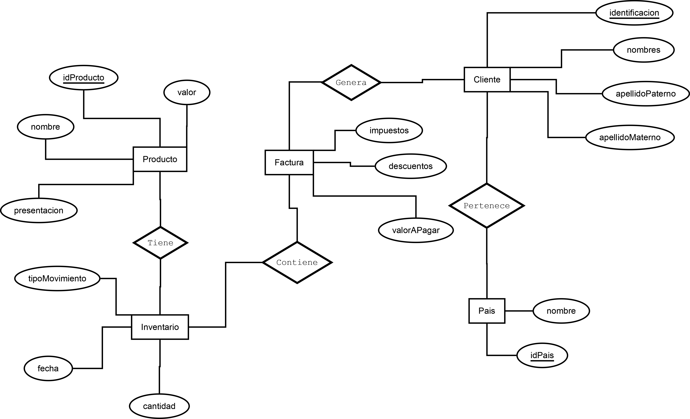
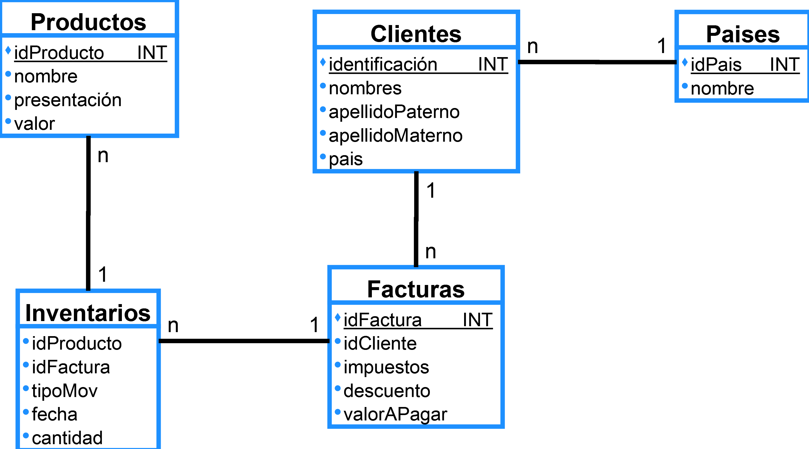

# EjercicioSQL
Ejercicio de consultas SQL ejemplo de una Zapateria
> Se utilizó el manejador PostgreSQL

> Héctor Andrey Hernández Alonso

## Contenido

* Tablas:
  * Contiene el código necesario para  la creación de las tablas

* Trigger:
    * Contienen el disparador para la funcionalidad con la factura y el inventario
* PobladoTablas:
  * Código que  llena las tablas de la base de datos
* Consultas:
  * Consultas SQL indicadas

### Diagrama Entidad - Relación

### Modelo Relacional 

